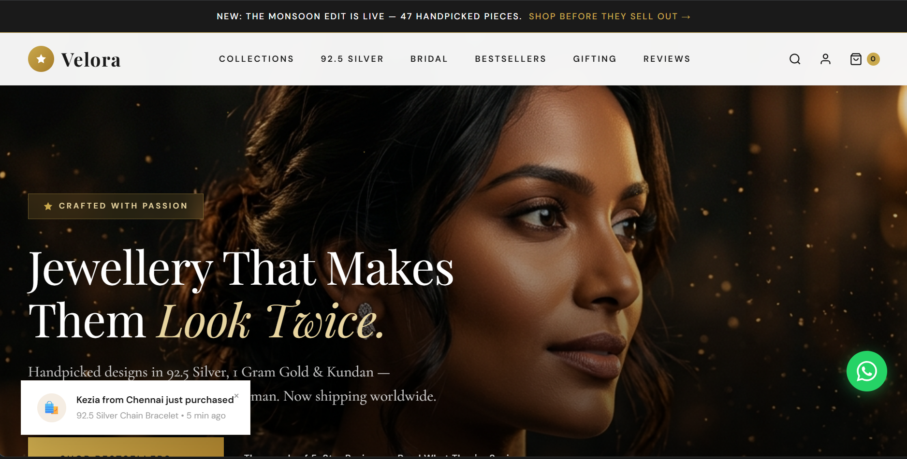
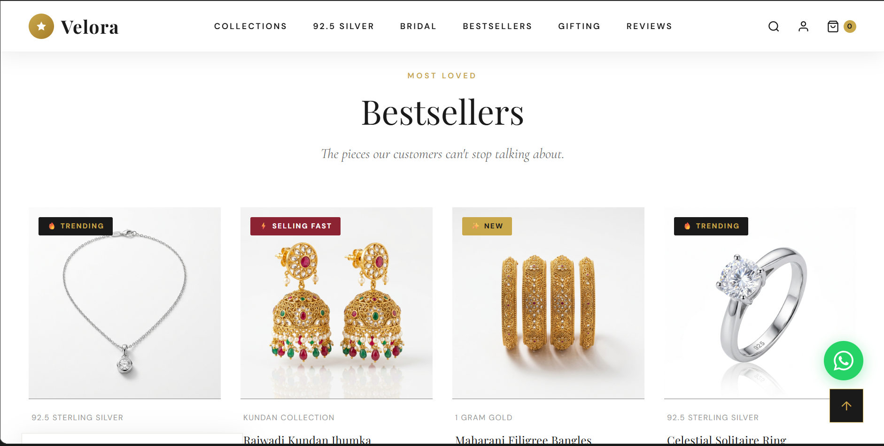
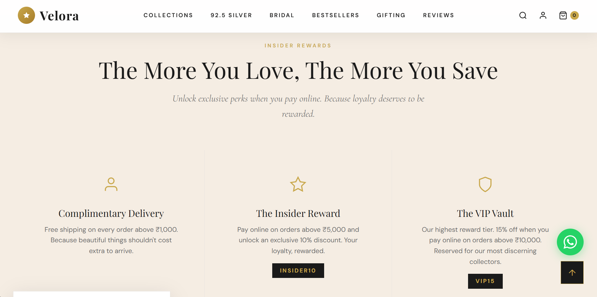
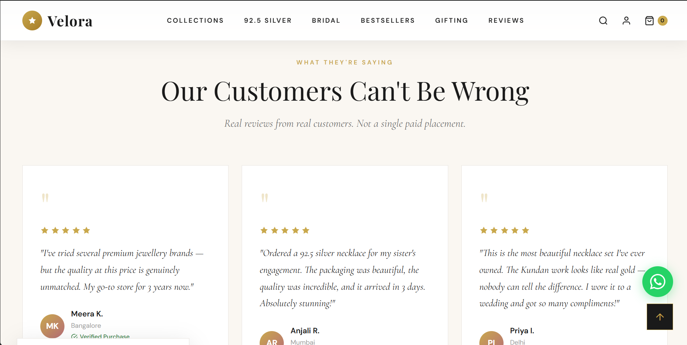

# Velora — Luxury Jewellery E-Commerce UI

> A high-conversion, premium jewellery e-commerce frontend 
> built with vanilla HTML, CSS & JavaScript.

## ✨ Features
- Cinematic hero with parallax + gold particle effects
- FOMO engine (real-time purchase toasts)
- Scroll-triggered animations (IntersectionObserver)
- Product detail page with gallery, variants & urgency signals
- Mobile-first responsive design
- Social proof wall with review carousel

## � Screenshots

## ⚠️ Disclaimer
This project is created as a **learning exercise** by a college student and is not affiliated with any brand, company, or real-world jewellery business. All images, designs, and content are for **educational and portfolio purposes only**. This is a demonstration of frontend development skills and UI/UX design principles.
